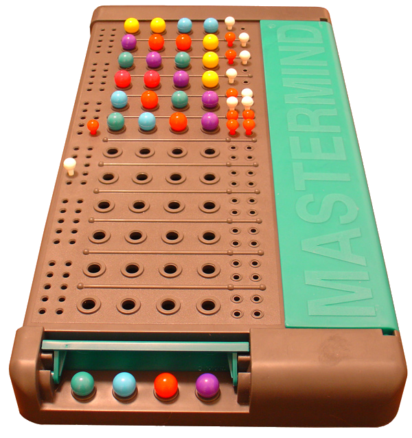

# mastermind-game

[](https://nodejs.org/api/documentation.html#documentation_stability_index)
[](https://www.npmjs.com/package/mastermind-game)
[](https://github.com/feross/standard)
[](https://travis-ci.org/garbados/mastermind-game)
[](https://coveralls.io/github/garbados/mastermind-game?branch=master)
[](https://greenkeeper.io/)



Play [Mastermind](https://en.wikipedia.org/wiki/Mastermind_%28board_game%29) in your terminal!

## Install

To play, you'll need [node.js](https://nodejs.org/) installed. Then, use [npm](https://www.npmjs.com/) to install:

```bash
$ npm i -g mastermind-game
```

Then, just type this in your terminal:

```bash
$ mastermind-game
```

...and the game will begin!

It looks like this:

```bash
$ mastermind-game
Do you want to play a game?

I am thinking of a sequence of 4 numbers between 1 and 6.
Can you guess the sequence?

Please enter your guess: 1 1 2 2
┌─────────┬──────────────────┬────────────────┐
│ Guess   │ Correct Position │ Correct Number │
├─────────┼──────────────────┼────────────────┤
│ 1 1 2 2 │ 1                │ 1              │
└─────────┴──────────────────┴────────────────┘
Please enter your guess:
```

For more information, try `mastermind-game -h` or `mastermind-game --help`!

## Writing Strategies

You can use `mastermind-game` as a module and write your own strategies! Install it like so:

```bash
npm i -S mastermind-game
```

Then, sub-class `GameForMachines` and implement `.guess()`:

```javascript
const {GameForMachines} = require('mastermind-game')

class MyStrategy extends GameForMachines {
  guess (history) {
    // write your strategy's logic here!
  }
}
```

Check out [GameForMachines](https://garbados.github.io/mastermind-game/module-mastermind-game-GameForMachines.html) for more information on writing strategies.

## Tests

Download the project's source in order to run the test suite:

```bash
git clone https://github.com/garbados/mastermind-game.git
cd mastermind-game
npm install
npm test
```

You can run `npm run cov` to see a report of test coverage.

## Contributing

All contributions are welcome: bug reports, feature requests, "why doesn't this work" questions, patches for fixes and features, etc. For all of the above, [file an issue](https://github.com/garbados/mastermind-game/issues) or [submit a pull request](https://github.com/garbados/mastermind-game/pulls).

## License

[GPL-3.0](https://opensource.org/licenses/gpl-3.0.html)
